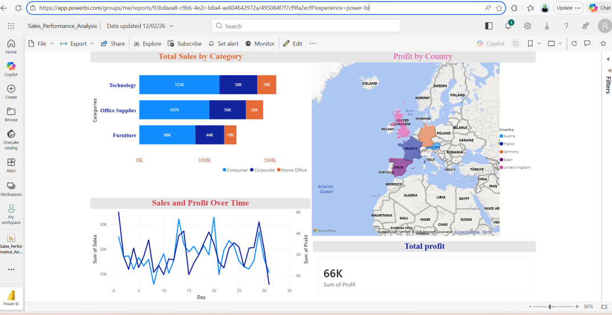

# Michele Butti - Data Analytics Portfolio

Welcome to my portfolio! I am a Data Analyst with a First-Class background in International Business Management, specialized in transforming raw data into strategic business insights.

## 📊 Power BI Showcase: Sales Performance Analysis
This project features an interactive dashboard analyzing European sales trends and profit optimization.
* **Key Achievement:** Identified profit optimization opportunities totaling £66K.
* **Tools Used:** Power BI, Power Query, DAX.

## 🐍 Python & Data Engineering
This repository contains technical notebooks demonstrating data manipulation and algorithmic logic:
* **Python_Data_Analysis_Pandas.ipynb**: Data cleaning and exploratory analysis.
* **Python_Logic_FizzBuzz_Task.ipynb**: Implementation of core programming concepts and logic.

## 🛠 Technical Skills
* **Languages:** Python (Pandas, NumPy), SQL
* **Data Visualization:** Power BI, Tableau, Excel
* **Cloud & Tools:** Azure, Google Colab, GitHub

* ## 📈 Advanced Excel: Sales & Profit Dashboard
Created a dynamic dashboard using Pivot Tables to analyze sales distribution and profit margins across different product categories.
* **Tools Used:** Excel (Pivot Tables, Data Aggregation, Data Visualization).

 
